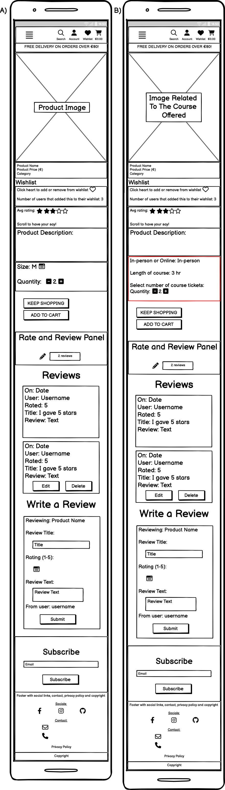
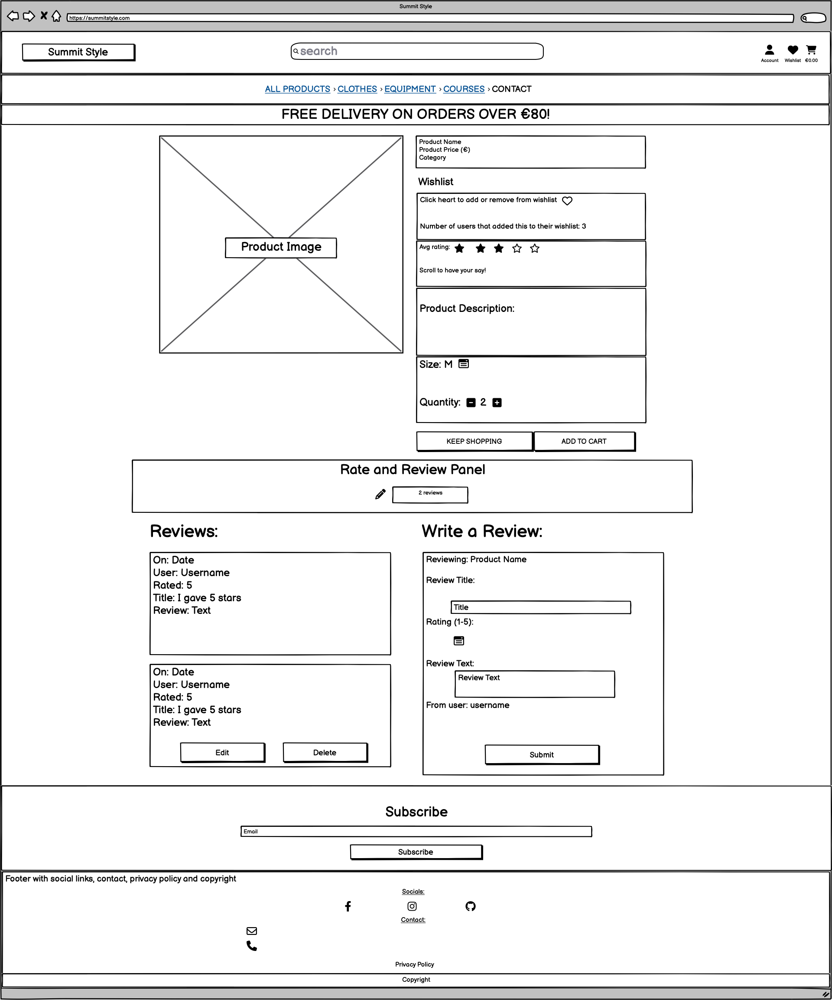

# Summit Style

(Developer: Katie Dunne)


## Live website

Link to live website: [Summit Style](https://summit-style-b727a186ee80.herokuapp.com/)

## Purpose of the project

Here is an eCommerce website, for a fictitious business called Summit Style. This is a full stack website built using the Django web framework. This business sells adventure clothing, equipment and short educational courses based on outdoor skills. There is a star rating feature on all products and courses. There is a app for testimonals which shows 3 testimonials on the front end, with an option to submit testimonials using a form. There is also a contact tab.

## Table of contents

## User experience (UX)

### Key project goals

### Target audience

- Users that are interested in outdoor and adventure hobbies
- Users that want to buy clothes that are specifically made with outdoor functionality (e.g. fleece, coats, base layers, wetsuits)
- Users that are interested in equipment for outdoor and adventure hobbies (e.g. tents, sleeping bags)
- Users that would like to learn about outdoors and adventure hobbies through short courses

### User requirements and expectations

## Epics and user stories

### Epics

1. Viewing and navigation of products and courses
2. Registration and user accounts
3. Sorting and searching
4. Purchasing and checkout
5. Store management
6. Rating and review feature
7. Testimonials app
8. Contact app

### User stories

- As a website user, I want to be able to:

1.	View a list of clothing products so that I can select some to buy
2.	View a list of outdoor equipment products so that I can select some to buy
3.	View a list of short courses so that I can select some to buy
4.	View a specific category of products or courses, so that I can quickly find what I'm interested in
5.	View individual product details so that I am informed of price, description and product rating
6.	View individual course details so that I am informed of price, description and rating
7.	Identify sale items easily, so that I can take advantage of savings on products I want to buy
8.	See the total of my purchases at any time to avoid overspending
9.	Register for an account so that I can have a profile that is specific to me
10.	Easily log in and out to access my personal account information and to protect it once I’m finished interacting with it
11.	Easily recover my password if I forget it so that I can recover access to my account
12.	Receive an email confirmation after registering to verify my account registration was successful
13.	Have a personalised user profile so that I can view my order history, order confirmations and save payment information
14.	Quickly separate a list of clothing products from a list of equipment and a list of courses
15.	Sort the list of offerings (clothes, equipment or courses) so that I can easily distinguish the best rated, the best priced or categorically sort products
16.	Sort a specific category of product or course, so that I can find the best rated or best priced in a specific category
17.	Search for a product or course by name or description so that I can find a specific product or course
18.	Easily see what I've searched for and the number of results so that I can quickly see if the product or course I want is available here
19.	Easily select the size of a product when purchasing it so that I don’t accidentally order the wrong size of clothing
20.	View items in my cart to be purchased so that I’m aware of the total cost of items and all the items that I will receive after checkout
21.	Adjust the quantity of individual items in my cart so that I can make changes to my order before checkout if I wish to do so
22.	Easily enter my personal payment information so that I can checkout quickly
23.	Feel that my personal and payment information is safe so that I can confidentially provide the information to make a purchase
24.	View an order confirmation after checkout so that I can verify that I haven’t made any mistakes
25.	Receive an email confirmation after I make a purchase so that I can keep the confirmation for my own records
26. See average star ratings on products quickly and easily, so that I don't have to go searching for ratings and I can buy a reliable product or course
27. Submit my star rating so that I can give a vote on how good the product or course is
28. Read reviews that other customers have submitted so that I feel I am purchasing a reliable product
29. Submit a review using a front end form with fields for title, star rating and review text
30. Edit the review I gave, in case I change my mind on how good a product or course is
31. Delete a review I submitted in case I rate the wrong product or I change my mind about giving my opinion
32. Read testimonials from other customers so that I feel like I am making a reliable purchase
33. Submit a testimonial of my own so that I can give my opinion on my purchase from this company
34. Find the contact page easily, so that I don't get frustrated trying to contact the company
35. Contact summit style using a contact form and recieve feedback that my query has been stored and the company will respond in a few days
36. Toggle a heart button to add and remove products and courses from my wishlist, so that when I have the money or when they go on special offer I can access them easily
37. Go to a page that has a list of my wishlist items, so that I don't have to spend time looking all over the site for items that I liked in the past

- As a store owner, I want to be able to:

38.	Add a product or course so that I can add new offerings as they become available for me to sell
39.	Edit or update a product or course information so that I can change product and course prices, descriptions and images if needed
40.	Delete a product or course so that I can remove items that are no longer for sale

## Sprints

1. Development environment setup
2. Design (wireframes and colors)
3. Data mapping of entity relationship diagrams
4. Viewing and navigation of products and courses
5. Registration and user accounts
6. Sorting and searching
7. Purchasing and checkout
8. Store management
9. Add rating and review feature
10. Testimonials app
11. Contact app
12. Testing
13. Project sunset

## Features

### Logo and navigation bar

#### Mobile navigation using burger menu

#### Monitor navigation bar

On monitor size screens, this is split into 2 divs. The top nav which contains the logo, a search bar, an account dropdown menu and a shopping cart logo with link to the shopping cart. This shopping cart also shows a running total of the users spend. The second part is the main site navigation bar. This main navbar contains downdown menus and links with titles; all products, clothes, equipment, courses, testimonials and contact.

### Hero image

The index page hero image was chosen because it fits the theme of the website. There is a man with hiking gear looking at some mountains in the distance. The colors of this image also align with the theme and design of the overall website.

### Shop now button

This is a call to action on the index page

### We're green section on the index page

### Newsletter sign up on the index page

### Average star rating and reviews

### Footer

### Custom 404 page

### MoSCoW

## Three custom models

1. Average Star Rating and Reviews

This has FE CRUD functionality for your rating and reviews

2. Testimonials App

This is on a testimonials app with tab of its own. This has 3 showing at the top half of the page and the ability to submit a testimonial through a form at the bottom half of the page

3. Record user contact requests in the database

This is on a contact app with tab of its own

## Future features

## Design

### Color

#### Color palette 1


#### Color palette 2


## Wireframes

### Index page wireframes

#### Mobile


#### Tablet


#### Monitor


### Product detail page

#### Mobile



#### Tablet


#### Monitor



## Database schema

### Entity relationship diagram

### Entity relationship tables

Please find a screenshot of tables below. These tables are in preparation for the final entity relationship diagram (ERD).


## Technology Used

### Languages

- [HTML5](https://developer.mozilla.org/en-US/docs/Learn/HTML "link to html mozilla documentation")
  was used to create content and structure
- [CSS](https://developer.mozilla.org/en-US/docs/Learn/CSS "link to css mozilla documentation")
  was used to add custom styles
- Javascript
- Python

### Frameworks and libraries
- [Django 4.2.10](https://www.djangoproject.com/ "link to django docs homepage") was the python framework used to develop the site
- Bootstrap

### Database

- [PostgreSQL from Code Institute](https://dbs.ci-dbs.net/ "link to postgresql from code institute") was used as the PostgreSQL database for this project

### Technologies and tools

- [Django allauth](https://docs.allauth.org/en/latest/ "link to official allauth documentation") addresses authentication, registration and account management

## Testing

Detailed testing documentation can be found

### Fixed bugs

Leaving this here as a reminder for me to come back to it later:

1. Webhook handler handling profiles
2. wh handler key and testing

### Unfixed bugs

### Supported screens and browsers

#### Screens

- iPhone SE, 375px wide. Also looks good down to 300px according to devtools
- iPad Mini, 768px wide
- Nest Hub Max, 1280px wide

#### Browsers

- Chrome
- Firefox
- Safari
- Edge
- Opera

## Deployment

### Pre deployment

### Stripe setup

This project used [Stripe](https://stripe.com) to handle all payments.

- Log in to [Stripe](https://stripe.com)
- Go to the developers section. The link is located in the top right of the page
- Go to API keys tab and copy the PUBLIC_KEY and SECRET_KEY and add them to your env.py file
- `STRIPE_PUBLIC_KEY` = starts with **pk**
- `STRIPE_SECRET_KEY` = starts with **sk**
- Go to the Webhooks tab and click on add endpoint
- Here you will need to give a link to the deployed application. The link should look like this: https://your_website.herokuapp.com/checkout/wh/
- Choose the events the webhook should receive and add endpoint
- You'll be given another key, the stripe webhook secret
- `STRIPE_WH_SECRET` = starts with **wh**
- When the application is deployed, run a test purchase to ensure the webhooks are working
- Go back to the webhooks page to check the events

### AWS setup

This project used [AWS](https://aws.amazon.com) to store static and media files.

Follow these steps to connect the project to AWS.

- Create an AWS account and login
- Go to the AWS Management Console under My Account

#### S3 Bucket

- Search for S3
- Create a new bucket, give it a name (usually matching your Heroku app name) and choose the region closest to you
- Under Object Ownership select ACLs enabled
- Make sure that Bucket Owner Preferred option is ticked
- Uncheck Block all public access and acknowledge that the bucket will be public
- Click Create Bucket
- From the Properties tab, turn on static website hosting and type `index.html` and `error.html` in their respective fields, then click Save
- From the Permissions tab, paste in the following CORS configuration:

```
[
 {
  "AllowedHeaders": [
   "Authorization"
  ],
  "AllowedMethods": [
   "GET"
  ],
  "AllowedOrigins": [
   "*"
  ],
  "ExposeHeaders": []
 }
]
```

From the Bucket Policy tab, select the Policy Generator link, and use the following steps:

- Policy Type: S3 Bucket Policy
- Effect: Allow
- Principal: `*`
- Actions: GetObject
- Amazon Resource Name (ARN): paste the arn from the bucket policy here
- Click Add Statement
- Click Generate Policy
- Copy the entire Policy, and paste it into the Bucket Policy Editor
- Add a /* on to the end of the resource key, because we want to allow access to all resources in this bucket

```
{
  "Id": "Policy1234567890",
  "Version": "2012-10-17",
  "Statement": [
  {
    "Sid": "Stmt1234567890",
    "Action": [
    "s3:GetObject"
    ],
    "Effect": "Allow",
    "Resource": "arn:aws:s3:::your-bucket-name/*"
    "Principal": "*",
  }
  ]
}
```

- Click Save
- Go to the Access Control List (ACL) tab and set the List Objects Permission to Everyone (public access)
- Accept the warning box

#### IAM

The procedure here is; 1. you should create a group for the user to live in, 2. create an access policy giving the group access to the s3 bucket that was created and 3. assign a user to the group, so that it can use the policy to access all the files.

Go back to the AWS Services Menu and follow these steps:

1. Create a group

- Search for IAM (Identity and Access Management) and open it
- Click on create user group
- Add a name and click create group. The users and permission policies will be added later

2. Create an access policy

- Click the policies button on the left hand side and then click the create policy button
- Click on actions and import policy
- Search for "AmazonS3FullAccess", select this policy, and click Import
- Click "JSON" under "Policy Document" to see the imported policy
- Copy the bucket ARN from the bucket policy page and paste it into the "Resource" section of the JSON snippet. 
- Copy the bucket ARN a second time into the "Resource" section of the JSON snippet. This time, add "/*" to the end of the ARN to allow access to all resources in this bucket

```
    {
    "Version": "2012-10-17",
    "Statement": [
        {
            "Effect": "Allow",
            "Action": [
                "s3:*",
                "s3-object-lambda:*"
            ],
            "Resource": [
                "arn:aws:s3:::your-project",
                "arn:aws:s3:::your-project/*"
            ]
        }
    ]
}

```

- On the next page add polcity name and description and click create policy
- To attach Policy to User Group, first click on User Groups in the left-hand menu
- Click on the user group name created during the above step and select the permissions tab
- Click Attach Policy
- Search for the policy you just created, select it and click attach policy

3. Create User

- On the users page, click on add user
- Enter a User name 
- Select Programmatic access and AWS Management Console access and click next
- Click on add user to group, select the user group created earlier and click create user
- Take note of the Access key and Secret access key as these will be needed to connect to the S3 bucket
- At this point it's important to download and save this CSV file containing the access keys, because once you have gone through this process you can't download them again


#### Final steps for AWS setup

- Configure Django to connect to S3

### Deploying with heroku

### Fork this repository:

- Go to the [GitHub repository](https://github.com/KSDunne/summit_style)
- Click on the Fork button in the upper right-hand corner
- Once clicked, you should have a copy of the original repository in your own GitHub account

### Clone

The repository can be cloned by following these steps:

- Go to the [GitHub repository](https://github.com/KSDunne/summit_style)
- Click the Code button near the top of the page
- Select 'HTTPS', 'SSH', or 'Github CLI', depending on how you would like to clone
- Click the copy button to copy the URL to your clipboard
- Open Git Bash
- Change the current working directory to where you want the cloned directory
- Type git clone and paste the URL ($ git clone https://github.com/YOUR-USERNAME/YOUR-REPOSITORY)
- Press enter to create your clone locally

Note: The difference between fork and clone is, you need permissions to push back to the original from a clone, but not a fork. This is because a fork will be completely your own new project.

## Credits

### Code

[Star rating tutorial](https://medium.com/p/e1deff03bb1c)
[Wishlist logic](https://github.com/Code-Institute-Solutions/Django3blog/blob/master/10_likes/blog/views.py#L69)
[Wishlist product detail heart](https://github.com/Code-Institute-Solutions/Django3blog/blob/master/10_likes/templates/post_detail.html#L36)
[My wishlist template](https://github.com/Harry-Leepz/Nourish-and-Lift/blob/main/wishlist/templates/wishlist/wishlist.html)

### Media

### Inspiration from real world ecommerce websites

## Acknowledgements

Thank you to family, friends and pets for the support. Also thank you to my mentor and CI cohort facilitator :sparkles:
