# Summit Style

(Developer: Katie Dunne)


## Live website

Link to live website: [Summit Style](https://summit-style-b727a186ee80.herokuapp.com/)

## Purpose of the project

Here is an eCommerce website, for a fictitious business called Summit Style. This is a full stack website built using the Django web framework. This business sells adventure clothing, equipment and short educational courses based on outdoor skills. The user experience provides value to the customer with a star rating feature on all products and courses, so the user can buy products that other customers like too. All offerings have a review feature for the same reason. There is a wishlist feature, so that customers can buy items when they go on sale or when they have the money to buy them and there is also a contact tab.

This website was built for Project 5 of the Code Institute Diploma in Software Development and does not process actual payments. As a result, any orders made will not be fulfilled.

To explore the payment feature, you can use the following card details when prompted:

- Card number: 4242 4242 4242 4242
- Expiry date: any future date (e.g. 10/26)
- CVC: any 3 digits (e.g. 123)
- ZIP: any 5 digits (e.g. 42424)

## Table of contents

- [User experience (UX)](#user-experience-ux)
   * [Key project goals](#key-project-goals)
   * [Target audience](#target-audience)
   * [User requirements and expectations](#user-requirements-and-expectations)
- [Epics and user stories](#epics-and-user-stories)
   * [Epics](#epics)
   * [User stories](#user-stories)
- [Sprints](#sprints)
- [Features](#features)
   * [Logo and navigation bar](#logo-and-navigation-bar)
   * [Hero image with cover text](#hero-image-with-cover-text)
   * [Clear indication as to whether the user is logged in or out](#clear-indication-as-to-whether-the-user-is-logged-in-or-out)
      + [Clear indication for when the user is logged in](#clear-indication-for-when-the-user-is-logged-in)
      + [Clear indication for when the user is logged out](#clear-indication-for-when-the-user-is-logged-out)
   * [Shop now button](#shop-now-button)
   * [We're responsible](#were-responsible)
   * [We educate](#we-educate)
   * [We're green section](#were-green-section)
   * [Newsletter sign up](#newsletter-sign-up)
   * [Footer](#footer)
   * [Sign in form](#sign-in-form)
   * [Register form (Sign up)](#register-form-sign-up)
   * [Sign out page](#sign-out-page)
   * [Shopping cart empty](#shopping-cart-empty)
   * [Shopping cart with items](#shopping-cart-with-items)
   * [Search bar](#search-bar)
   * [Product cards](#product-cards)
   * [Sort dropdown](#sort-dropdown)
   * [Product detail](#product-detail)
   * [Average star rating](#average-star-rating)
   * [Rate and review panel](#rate-and-review-panel)
   * [Edit the rate and review form that I submitted](#edit-the-rate-and-review-form-that-i-submitted)
   * [Delete the rate and review form that I submitted](#delete-the-rate-and-review-form-that-i-submitted)
   * [Add item to wishlist](#add-item-to-wishlist)
   * [Remove item from wishlist](#remove-item-from-wishlist)
   * [Wishlist page](#wishlist-page)
   * [Contact page](#contact-page)
   * [Contact page hero image](#contact-page-hero-image)
   * [Contact form](#contact-form)
   * [Contact form validation](#contact-form-validation)
   * [Checkout order summary](#checkout-order-summary)
   * [Checkout form](#checkout-form)
   * [Checkout success page](#checkout-success-page)
   * [Profile](#profile)
   * [Order history](#order-history)
   * [Past order confirmation](#past-order-confirmation)
   * [Add product page](#add-product-page)
   * [Edit product](#edit-product)
   * [Delete product](#delete-product)
   * [Registration email](#registration-email)
   * [Order confirmation email](#order-confirmation-email)
   * [Custom 404 page](#custom-404-page)
- [Future features](#future-features)
- [MoSCoW](#moscow)
- [Three custom models](#three-custom-models)
- [Ecommerce business model](#ecommerce-business-model)
- [Keyword research and SEO](#keyword-research-and-seo)
   * [Hiking clothes keyword](#hiking-clothes-keyword)
   * [Hiking equipment keyword](#hiking-equipment-keyword)
   * [Adventure courses keyword](#adventure-courses-keyword)
- [Marketing](#marketing)
   * [Strategy](#strategy)
   * [Newsletter](#newsletter)
   * [Facebook](#facebook)
- [Design](#design)
   * [Typography](#typography)
   * [Color](#color)
- [Wireframes](#wireframes)
   * [Index page wireframes](#index-page-wireframes)
   * [Products page](#products-page)
   * [Product detail page](#product-detail-page)
   * [Contact page](#contact-page-1)
   * [Wishlist page](#wishlist-page-1)
   * [Register page](#register-page)
   * [Login page](#login-page)
- [Database schema](#database-schema)
   * [Entity relationship diagram](#entity-relationship-diagram)
   * [Entity relationship tables](#entity-relationship-tables)
- [Technology Used](#technology-used)
   * [Languages](#languages)
   * [Frameworks and libraries](#frameworks-and-libraries)
   * [Database](#database)
   * [Technologies](#technologies)
- [Testing](#testing)
   * [Fixed bugs](#fixed-bugs)
   * [Unfixed bugs](#unfixed-bugs)
   * [Supported screens and browsers](#supported-screens-and-browsers)
- [Deployment](#deployment)
   * [Pre deployment](#pre-deployment)
   * [Stripe setup](#stripe-setup)
   * [AWS setup](#aws-setup)
      + [S3 Bucket](#s3-bucket)
      + [IAM](#iam)
      + [Final steps for AWS setup](#final-steps-for-aws-setup)
   * [Deploying with heroku](#deploying-with-heroku)
   * [Fork this repository](#fork-this-repository)
   * [Clone](#clone)
- [Credits](#credits)
   * [Code](#code)
   * [Media](#media)
   * [Inspiration from real world ecommerce websites](#inspiration-from-real-world-ecommerce-websites)
- [Acknowledgements](#acknowledgements)

## User experience (UX)

### Key project goals

1. Build a website that quickly conveys the message that it is an adventure themed shop
2. Create a website where users can see the details of what is being sold and can readily purchase the offerings
3. Add 3 features that enhance the experience of a user visiting an ecommerce website; 1. star ratings and reviews, 2. a wishlist feature and 3. a contact form.

### Target audience

- Users that are interested in outdoor and adventure hobbies
- Users that want to buy clothes that are specifically made with outdoor functionality (e.g. fleece, coats, base layers, wetsuits)
- Users that are interested in equipment for outdoor and adventure hobbies (e.g. tents, sleeping bags)
- Users that would like to learn about outdoors and adventure hobbies through short courses

### User requirements and expectations

- Easy navigation whether using mobile, tablet or monitor
- Ability to quickly understand the purpose of the website
- An accessible website for all users
- A secure payment system
- A secure data protection policy
- Detailed product information
- Visually appealing and responsive design
- An ability to see how other customers rate and review products
- An ability to add products to a wishlist for interaction at a later time
- An ability to contact the business easily
- Users expect businesses to have responsible ethics

## Epics and user stories

### Epics

1. Viewing and navigation of products and courses
2. Registration and user accounts
3. Sorting and searching
4. Purchasing and checkout
5. Store management
6. Rating and review feature
7. Wishlist feature
8. Contact app

### User stories

- As a website user, I want to be able to:

1. From a page that conveys an outdoor themed hero image, navigate to and view a list of clothing products, so that I can select some to buy (maps to epic 1 and project goal 1)
2. View a list of outdoor equipment products, so that I can select some to buy (epic 1)
3. View a list of short courses, so that I can select some to buy (epic 1)
4. View a specific category of products or courses, so that I can quickly find what I'm interested in (epic 1)
5. View individual product details, so that I am informed of price, description and product rating (maps to epic 1 and project goal 2)
6. View individual course details, so that I am informed of price, description and rating (epic 1)
7. Identify sale items easily, so that I can take advantage of savings on products I want to buy (epic 1)
8. See the total of my purchases at any time to avoid overspending (epic 4)
9. Register for an account, so that I can have a profile that is specific to me (epic 2)
10. Easily log in and out to access my personal account information and to protect it once I’m finished interacting with it (epic 2)
11. Easily recover my password if I forget it, so that I can recover access to my account (epic 2)
12. Receive an email confirmation after registering to verify my account registration (epic 2)
13. Have a personalised user profile, so that I can view my order history, order confirmations and save delivery information (epic 2)
14. Quickly separate a list of clothing products from a list of equipment and a list of courses (epic 3)
15. Sort the list of offerings (clothes, equipment or courses), so that I can easily distinguish the best priced or categorically sort products (epic 3)
16. Sort a specific category of product or course, so that I can find the best priced in a specific category (epic 3)
17. Search for a product or course by name or description so that I can find a specific product or course (epic 3)
18. Easily see what I've searched for and the number of results so that I can quickly see if the product or course I want is available here (epic 3)
19. Easily select the size of a product when purchasing it, so that I don’t accidentally order the wrong size of clothing (epic 4)
20. View items in my cart to be purchased, so that I’m aware of the total cost of items and all the items that I will receive after checkout (epic 4)
21. Adjust the quantity of individual items in my cart, so that I can make changes to my order before checkout if I wish to do so (epic 4)
22. Easily enter my personal payment information, so that I can checkout quickly (epic 4)
23. Feel that my personal and payment information is safe, so that I can confidentially provide the information to make a purchase (epic 4)
24. View an order confirmation after checkout, so that I can verify that I haven’t made any mistakes (epic 4)
25. Receive an email confirmation after I make a purchase, so that I can keep the confirmation for my own records (epic 4)
26. See average star ratings on products quickly and easily, so that I don't have to go searching for ratings and I can buy a reliable product or course (maps to epic 6 and project goal 3)
27. Submit my star rating, so that I can give a vote on how good the product or course is (epic 6)
28. Read reviews that other customers have submitted, so that I feel I am purchasing a reliable product (epic 6)
29. Submit a review using a front end form with fields for title, star rating and review text (epic 6)
30. Edit the review I gave, in case I change my mind on how good a product or course is (epic 6)
31. Delete a review I submitted in case I rate the wrong product or I change my mind about giving my opinion (epic 6)
32. Read testimonials from other customers so that I feel like I am making a reliable purchase
33. Submit a testimonial of my own so that I can give my opinion on my purchase from this company
34. Find the contact page easily, so that I don't get frustrated trying to contact the company (maps to epic 8 and project goal 3)
35. Contact summit style using a contact form and receive feedback that my query has been stored and the company will respond in a few days (epic 8)
36. Toggle a heart button to add and remove products and courses from my wishlist, so that when I have the money or when they go on special offer I can access them easily (maps to epic 7 and project goal 3)
37. Go to a page that has a list of my wishlist items, so that I don't have to spend time looking all over the site for items that I liked in the past (epic 7)
38. Easily locate the privacy policy, so that I can see how my personal data is protected (epic 2)

- As a store owner, I want to be able to:

39. Add a product or course, so that I can add new offerings as they become available for me to sell (epic 5)
40. Edit or update a product or course information, so that I can change product and course prices, descriptions and images if needed (epic 5)
41. Delete a product or course, so that I can remove items that are no longer for sale (epic 5)
42. Not delete products by an accident. I get asked are you sure (epic 5)

## Sprints

1. Development environment setup
2. Design (wireframes and colors)
3. Data mapping of entity relationship diagrams
4. Viewing and navigation of products and courses
5. Registration and user accounts
6. Sorting and searching
7. Purchasing and checkout
8. Store management
9. Add rating and review feature
10. Wishlist feature
11. Contact app
12. Testing
13. Project sunset

## Features

### Logo and navigation bar

#### Monitor navigation bar

On monitor size screens, this is split into 2 divs. The top nav which contains the logo, a search bar, an account dropdown menu, a wishlist icon and a shopping cart logo with link to the shopping cart. This shopping cart also shows a running total of the users spend. The second part is the main site navigation bar. This main navbar contains dropdown menus and links with titles; all products, clothes, equipment, courses and contact.


#### Mobile navigation using burger menu

On mobile and tablet size screens site navigation uses a burger menu and 4 icons. The burger menu has the following navigation options; home, all products, clothes, equipment, courses and contact. The 4 icons are; search, account, wishlist and shopping cart with the current spend displayed underneath it.


### Hero image with cover text

The index page hero image was chosen because it fits the theme of the website. There is a man with hiking gear looking at some mountains in the distance. The colors of this image also align with the theme and design of the overall website. The main mountain hero image can also be seen on allauth pages (e.g. register, login and logout)

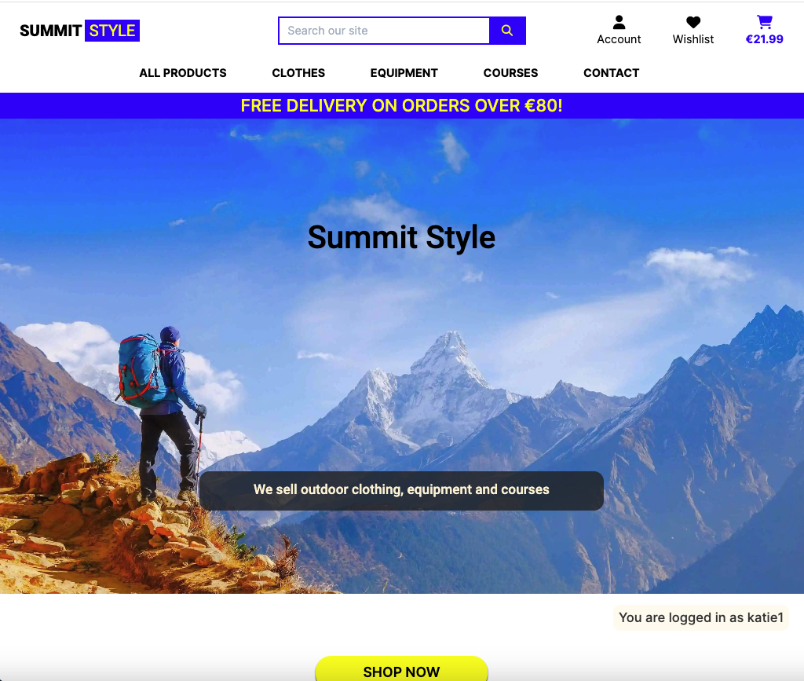

### Clear indication as to whether the user is logged in or out

The log in state is shown on toast when the user logs in. It is also very clearly displayed on multiple pages. These are the index page, the products page and the shopping cart. The reason I chose to show it on these pages is these are pages the user might navigate to before signing up. Seeing clearly that they are not logged in might prompt them to sign up. It is also helpful to display the login state on the shopping cart, so the user knows what user they are logged in as when they are about to navigate to the checkout.

#### Clear indication for when the user is logged in


#### Clear indication for when the user is logged out


### Shop now button

This is a call to action on the index page. This button brings the user to the all products page.

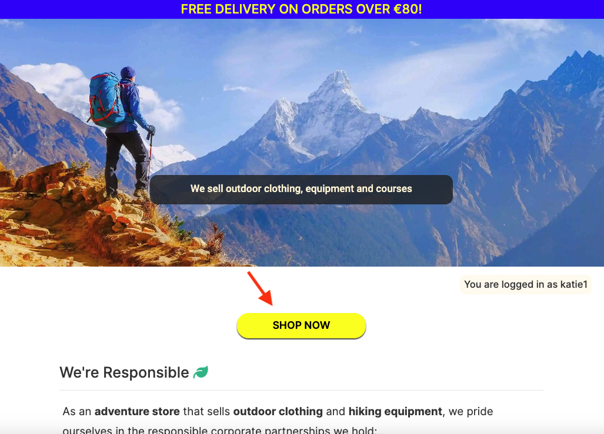

### We're responsible

This is a section on the index page to convey that summit style is an ethical company with responsible values. It shows that summit style uses recycled packaging and that they have a corporate partnership with a reforestation website.


### We educate

This section on the index page showcases the fundamental pillars supporting the courses available on this website.


### We're green section

These are responsive boxes highlighting again how summit style is a responsible, ethical and green company to buy from.


### Newsletter sign up

Mailchimp was used for the newsletter signup. The code for this is in base.html, so it shows up on all pages right above the footer.


### Footer

The footer has the business email, phone number, social media links, a link to the privacy policy and a copyright.


### Sign in form

This is a crispy form that asks for username and password. It was styled with a yellow background. There is a clear reason displayed here as to why users need to log in. It says 'To make a purchase or access your wishlist, please log in.'.


### Register form (Sign up)

This is a crispy form. It is styled with a light yellow background and I removed the bullet point dots that are normally present on the password instructions (e.g. your password must contain at least 8 characters). There is a clear reason displayed here as to why users need to register. It says 'Account holders can make purchases and access their very own wishlist.'.


### Sign out page

The signout page is defensive. It asks the user 'Are you sure you want to sign out?'


### Shopping cart empty

When a user clicks on the shopping cart, but they haven't added any items yet. The page will display "Your cart is empty" and a button to keep shopping.


### Shopping cart with items

This page shows the product image, the name of the product, the size if applicable, the sku, the price, quantity and subtotal for every product in the cart. The cart total, the delivery cost and the grand total are also displayed on this page.

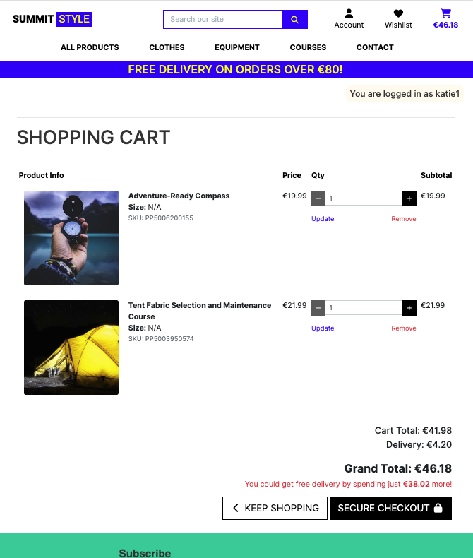

### Search bar

#### Search bar on mobile

When the user clicks on the magnifying glass a search bar form will dropdown. The search bar works well for item names and descriptions.


#### Search bar on a monitor

On monitor size screens, that is >992px, the search bar is displayed on the topnav.


### Product cards

Product cards contain a product image, name of the product, price, category and average rating. If you are logged in as a superuser you can also see edit and delete buttons. The delete button is defensive.


### Sort dropdown

The options for filtering are by price, name and category.


### Product detail

The product detail page contains a product image, name, price, category, toggle wishlist heart, star ratings, description, quantity buttons and size dropdown options if applicable. The product detail page also contains a rate and review panel.

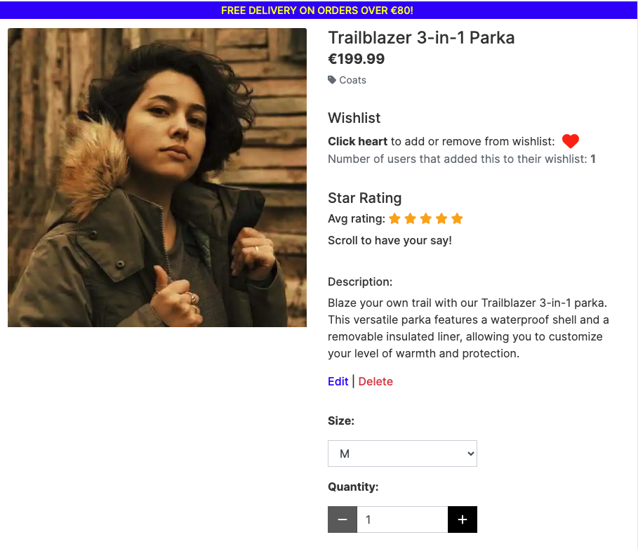

There are "keep shopping" and "add to cart" buttons here too.


### Average star rating

When multiple users add a rating, out of five, to the review form the average number is calculated. This average number is shown on the product detail page, the products page and the wishlist page.

Here is what it looks like on the product detail page.


Here is what it looks like on the product card.

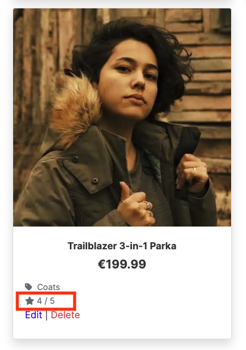

Here is what it looks like on the wishlist.

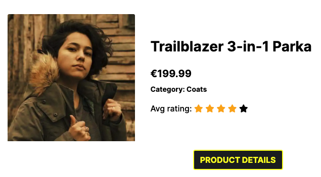

### Rate and review panel

This panel shows the number of reviews that have been submitted for that particular item, it shows the reviews from latest to oldest and there is a form for submitting your own review. The name of the item being reviewed is shown at the top of the form, so that the user doesn't write a review with the wrong product in mind and their username is shown at the bottom of the form for personalisation.


### Edit the rate and review form that I submitted

When the user clicks the edit button on a review that they submitted, they are directed to a review edit page with a pre-filled form. They can edit as they please and then click the 'edit review' button. This will send them back to the product detail page and success toast will appear stating 'your review has been updated!'. There is a 'cancel' button here too, so if the user changes their mind they can easily click the cancel button and this brings them back to the all products page instead of them navigating away from the site or using the back button.


### Delete the rate and review form that I submitted

When the user clicks the delete button on a review that they submitted, they are directed to a defensive page that says 'are you sure?'. If the user clicks confirm the review will be deleted.

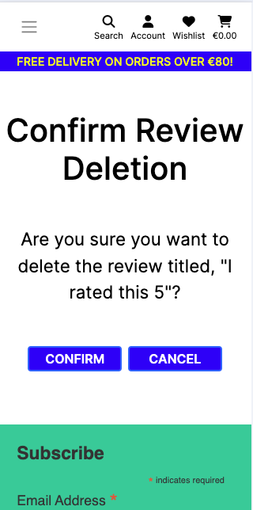

### Add item to wishlist

An item can be added to the users wishlist using the toggle heart on the product detail page. When the outline heart is clicked it adds the item to a personal wishlist and the number of users that have added this product to their wishlist increases by 1.


### Remove item from wishlist

If the user already added an item to their wishlist the heart will be solid. Clicking the solid heart will change it back to an outline. This will remove the item from the wishlist.


### Wishlist page

Items that have been added to the wishlist are listed on a page called 'my wishlist'. Clicking the product image here will bring the user to the product detail page.


### Contact page

There is a link to the contact page on the main navbar and the mobile dropdown navigation. The contact page gives multiple ways of contacting the business. There is a phone number, an email address and a contact form.


### Contact page hero image

The hero image on the contact page was choosen because it uses earthy colors that complement the outdoors theme of the website. The image shows 2 people on the phone.


### Contact form

The contact form is on the contact page. There are 6 fields, 4 of which are required. The fields are; name (required), phone, email (required), topic (required), availability for a course and message (required).


### Contact form validation

There is validation on the phone number field that implements the following, 'Phone number should contain only digits, spaces, parentheses, + or -'. This message shows on the form and error toast appears saying 'There was an error processing your request. See error displayed on the form.'. The error was triggered in this instance by adding an exclamation mark at the end of the phone number.


### Checkout order summary

The order summary on the checkout page shows the customer exactly what they are about to pay for. It shows how many items are in the cart and the quantity of each. It shows; a thumbnail image of the product, the product's name, price and size if applicable.


### Checkout form

The checkout form has fields for name and email address. An order confirmation will be sent to this email address. There is a section for the delivery address and a section for payment which is powered by Stripe. There is also a checkbox that the user can click to save the delivery information to their profile. This information will be pre-filled for the customer the next time they make a purchase.


### Checkout success page

The checkout success page informs the user that an order confirmation email will be sent and it gives the details of the order including billing information (order total, delivery cost and grand total).


### Profile

The main features on the profile page are 'default delivery information' and 'order history'. The default delivery information can be updated by editing the information in the fields and clicking the 'update information' button. An example of this can be seen in the screenshot below.


### Order history

The order history can be seen on the profile page and it contains a clickable order number, the date the orders were made, the items bought and the order total.


### Past order confirmation

A past order confirmation can be viewed by clicking the order number on the profile. An information toast appears tell the user that 'This is a past confirmation for order number XXXX. A confirmation email was sent on the order date'.


### Add product page

If a superuser is logged in, the word 'management' will be shown in the account dropdown. This is a link that brings the superuser to the add products page. There is a form on this page with all the fields relevant for adding a product. The fields are; category, sku, name, description, has sizes, is course, price and image url. There is also a select image button.


### Edit product

If a superuser is logged in, there will be edit and delete buttons on each product card and on the product detail pages. If the superuser clicks an edit button, they will be sent to an edit page with a form and pre-filled fields. Information toast will appear informing the user about which product they are currently editing. There is a 'cancel' button here and an 'update product' button.


### Delete product

If a superuser is logged in, there will be edit and delete buttons on each product card and on the product detail pages. If the superuser clicks the delete button, they will be sent to a defensive confirm deletion page with 2 buttons, 'confirm' and 'cancel'. The user is warned that this cannot be undone.


### Registration email

When a user signs up to summit style they will get an email with a link in it to confirm their account registration. The contents of the email can be seen in the screenshot below.


### Order confirmation email

When a user makes a purchase, the webhook settings allow a confirmation email to be sent to them. The contents of the email can be seen in the screenshot below.


### Custom 404 page

The custom error page has the same hero image as the index page, so that the user does not feel as though they have left the site. This page simply says 'the page you are looking for isn't available' and there is a 'return to shop' button.


## Future features

- Testimonials were classified as a 'could have' on this project. They were not implemented before assessment so they could be added in future.
- At the moment, a user is able to make multiple reviews on 1 product and this doesn't make much sense, because they have an edit feature, so why would they want to write another review on the same product? Therefore, a future feature could be that a user can only make one review per product.
- At the moment on courses, there is a section that says "in-person or online" and there is another section that says the "length of course". On submission of this project for assessment, these were all set to 'in-person' and '3 hr' using html. In future I would add these variables to a model, so they can be adjusted from admin.
- I noticed at a late date in my project building that I could have put reviews into its own app for separation of concerns. Therefore, in future this part of the project could be refactored.
- Notifications when items are sold out.
- Instant access to digital products. When a course is bought the customer instantly receives a PDF or access to a course video.
- Subscription to course material (pdfs and videos).

## MoSCoW

This project used the 'MoSCoW' method to classify its requirements and features according to their importance towards a minimum viable product (MVP). 'MoSCoW' stands for 'Must have, Should have, Could have and Won't have', with each classification aiding in the prioritization of features.

In the screenshot below it can be seen where 'must have' and 'should have' labels have been used and in the second screenshot underneath that one, it can be seen where 'could have' and 'won't have' labels were used.


See in the screenshot below that the 'could have' labels and 'wont have' labels ended up on the same issues. This occurred because they were initially classified as 'could have', until I got near to the deadline. Then I realised I wouldn't have time to implement the testimonial feature, so it was moved to 'won't have'. This was acceptable, because the testimonial feature was not necessary for mvp. Normal agile project dynamics were demonstrated here.


## Three custom models

1. Average Star Rating and Reviews

This has full FE CRUD functionality for your rating and reviews

2. Wishlist feature

There is a heart button that can be toggled on and off to add and remove items from your personal wishlist

3. Record user contact requests in the database

This is on a contact app with tab of its own

## Ecommerce business model

An ecommerce app is designed to facilitate commercial or business transactions, the model used for this app is outlined in the bullet points here:

- The core business intent of Summit Style is to provide a seamless ecommerce experience for outdoor enthusiasts
- Summit Style is a retail store and it is a B2C (business to customer) type of business
- The deliverables here are products (clothes, tents, sleeping bags) and services (if course is offered onsite)
- The website may offer digital products (if course is online) in future
- This business uses a single payment system, that is the transaction is finished after a single payment is made
- This business does not have a physical storefront, it is an online-only store

See marketing heading further down the readme document for newsletter and facebook marketing strategies.

## Keyword research and SEO

Good seo means that more potential customers can find your website. Keyword research tells us what topics people care about and how popular these topics are among your audience. Short-tail keywords are 1-2 words long and highly competitive. Long-tail keywords are usually in the form of a phrase or sentence and competition is lower.

Short tail keywords used on this app:

- Hiking clothes
- Hiking equipment
- Adventure courses
- Irish hiking
- Outdoors

Long tail keywords used on this app:

- Clothes for hiking in Ireland
- Hiking clothes Ireland
- Equipment for camping in Ireland
- Hiking equipment for beginners
- Irelands toughest hike
- Adventure courses in Ireland
- Outdoors shop dublin

Here are some screenshot examples of how I did my keyword research. It involved using the search bar in google and the suggested searches that popped up in the dropdown menu. I also looked at the longer tailed questions that were frequently asked on google.

### Hiking clothes keyword

See the screenshot of the dropdown on google for this short-tailed keyword


### Hiking equipment keyword

See the screenshot of the dropdown on google for this short-tailed keyword


### Adventure courses keyword

See the screenshot of the dropdown on google for this short-tailed keyword


Also, see a site I found during my research, that is selling online courses for mountaineering in Scotland


## Marketing

This site has a Mailchimp newsletter signup, which is used to collect email addresses for marketing purposes. A facebook business page was also setup. 

### Strategy

Summit Style plans to send monthly newsletters with information about upcoming sale items, future courses and photos of recent courses. The facebook strategy is to engage with customers on a more frequent basis, adding story pictures a couple of times per day and a facebook post at least 2 times per week.

### Newsletter

Here is a screenshot of the mailchimp email address form that is included in base.html. This can be seen on every page of the website.

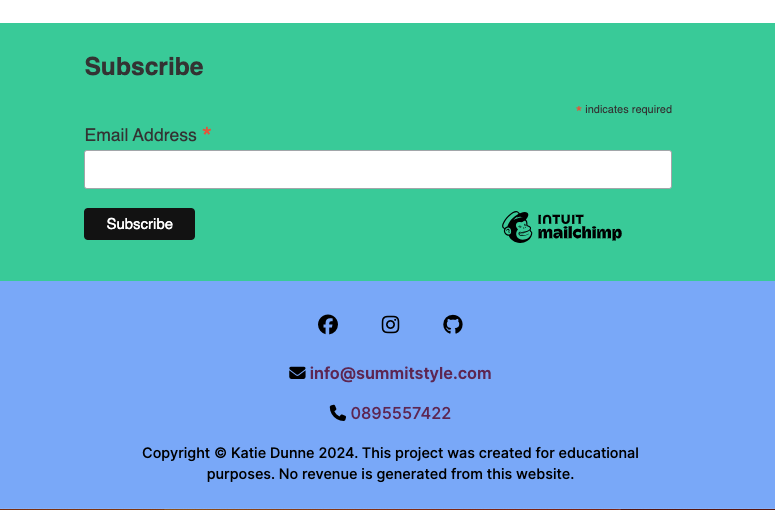

### Facebook

Firstly, a logo was designed using [hubspot brand kit generator](https://www.hubspot.com/brand-kit-generator). This was used as the profile picture for the facebook page. The logo includes an icon that looks like a person with a bag on their back, climbing a mountain and the business name beside the icon. The main hero image from the website was used as the cover photo.

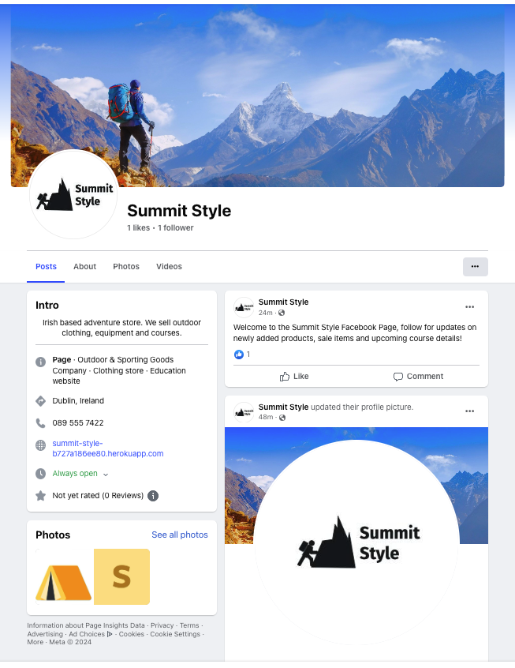

A 'sign up' call to action button was added to the facebook page that links back to the main heroku website encouraging facebook users to navigate to our site and sign up to the newsletter. A post was also created with a link to the live heroku website.


## Design

### Typography

Google Fonts were used to import Inter and Roboto fonts into base.html. A generic sans-serif font was chosen as a back-up font. These were chosen as they are common to modern website design and are easy to read.

### Color

Since this business is an outdoors themed shop I chose earthy colors. I also kept accessibility in mind when choosing colors and I used a color blind friendly palette for inspiration. Colors were adapted from palettes generated using [Venngage's accessible color palette generator](https://venngage.com/tools/accessible-color-palette-generator).

Primary Colors - White / Blue / Yellow

#### Color palette 1


Secondary Colors - Black / Green / Grey

#### Color palette 2

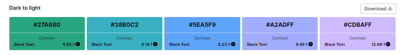

## Wireframes

### Index page wireframes

#### Mobile


#### Tablet


#### Monitor


### Products page

#### Mobile


#### Tablet


#### Monitor


### Product detail page

Two of the three custom models can be seen here.

- Firstly the product model which uses a 'wishlist' field can be seen here with a toggle heart and an 'is_course' boolean field that changes the sizes section to a section that contains whether the course is in-person or online and the length of the course.

- Secondly, the star model comes through here with full crud functionality for ratings and reviews.

#### Mobile


#### Tablet


#### Monitor


### Contact page

- The third custom model can be seen on the FE here.

#### Mobile


#### Tablet


#### Monitor


### Wishlist page

- The 'many-to-many' wishlist field in the product model is utilised on this page.

#### Mobile


#### Tablet


#### Monitor


### Register page

#### Mobile


#### Tablet

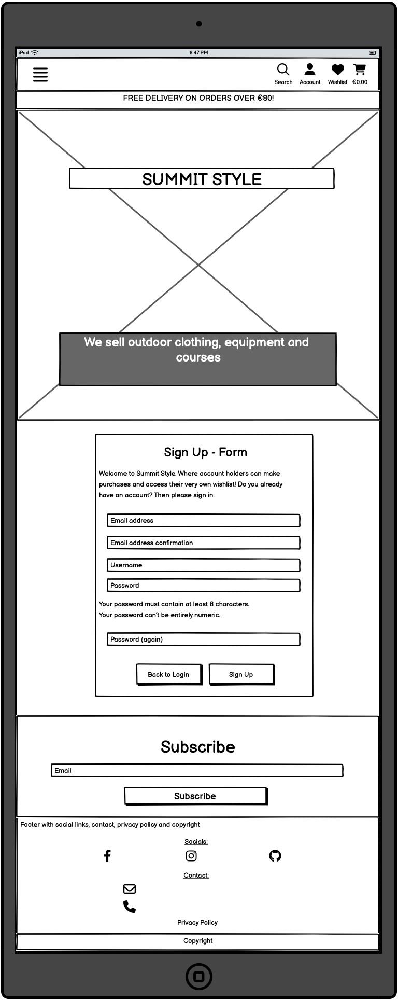

#### Monitor


### Login page

#### Mobile


#### Tablet


#### Monitor


## Database schema

### Entity relationship diagram

In the diagram below, OneToOne, ManyToMany and Foreign Key relationships can be seen.


### Entity relationship tables

Please find a screenshot of tables below. These tables were created as rough work in preparation for the final entity relationship diagram (ERD).


## Technology Used

### Languages

- [HTML5](https://developer.mozilla.org/en-US/docs/Learn/HTML "link to html mozilla documentation")
  was used to create content and structure
- [CSS](https://developer.mozilla.org/en-US/docs/Learn/CSS "link to css mozilla documentation")
  was used to add custom style
- [JavaScript](https://developer.mozilla.org/en-US/docs/Web/javascript "link to javascript mozilla documentation") was used for stripe elements
- [Python](https://docs.python.org/3/ "link to python documentation") was the main programming language used in this project

### Frameworks and libraries

- [Django 4.2.10](https://www.djangoproject.com/ "link to django docs homepage") was the python framework used to develop the site
- [Bootstrap 4.6.2](https://getbootstrap.com/docs/4.6/getting-started/introduction/ "link to bootstrap documentation") was used for the main style of the website

### Database

- [PostgreSQL from Code Institute](https://dbs.ci-dbs.net/ "link to postgresql from code institute") was used as the PostgreSQL database for this project

### Technologies

- [VS Code](https://code.visualstudio.com/ "link to visual studio code webpage") was used as the ide for this whole project
- [GitHub](https://github.com/ "link to github webpage") was used to store the code files, assets and README
- [Git](https://git-scm.com/ "link to official git website") was used as version control software to commit and push the code to the GitHub repository
- [Heroku](https://id.heroku.com/login "link to Heroku login") was used to deploy the project
- [dbdiagram](https://dbdiagram.io/ "link to dbdiagram") was used to make a diagram of the database schema. The diagram was based off erd tables that were documented in excel
- [Excel](https://microsoft.com/excel "link to official microsoft excel website") was used to created entity relationship tables in preparation for the database schema that was made in dbdiagram
- [Django allauth](https://docs.allauth.org/en/latest/ "link to official allauth documentation") addresses authentication, registration and account management
- [Stripe](https://stripe.com/ "link to official stripe website") was used for all payment processing
- [AWS](https://aws.amazon.com/ "link to official aws website") was used to host static and media files
- [Prettier](https://prettier.io/ "link to official prettier website") was used as the default formatter in Visual Studio Code IDE, for html and css files. The setting 'format on save' was used
- [Black Formatter for Python](https://marketplace.visualstudio.com/items?itemName=ms-python.black-formatter "link to official black formatter website") was used as the default formatter in Visual Studio Code IDE, for python files. The setting 'format on save' was used
- [Balsamiq](https://balsamiq.com/wireframes/ "link to official balsamiq website") was used in early planning to map out wireframes
- [Google Fonts](https://fonts.google.com/ "link to official google fonts website") was used to import fonts
- [Favicon Generator](https://favicon.io/favicon-generator/ "link to official favicon generator website") was used to make a tent shaped favicon
- [Font Awesome](https://fontawesome.com/ "link to official font awesome website") was used for all icons
- [Google Chrome Developer Tools](https://developer.chrome.com/docs/devtools/overview/ "Link to official chrome developer tools website") was used for lighthouse testing, debugging and consistently checking responsiveness
- [W3C Markup Validator](https://validator.w3.org/ "link to official html validator") was used to validate all live html
- [Jigsaw CSS Validator](https://jigsaw.w3.org/css-validator/ "link to official css validator") was used to validate CSS code
- [JS Hint](https://jshint.com/ "link to official javascript validator") was used to validate JavaScript code
- [Code Institute Python Linter](https://pep8ci.herokuapp.com/ "link to official python validator") was used to validate all python code
- [Django Crispy Forms](https://pypi.org/project/django-crispy-forms/ "link to official crispy forms website") were used throughout the project to quickly create forms
- [Chat-GPT](https://chat.openai.com/ "link to chat gpt") was used to create the name of offerings, the description and a price. I queried by giving an example of the details for 1 product and then typing "please give me 10 more products for an adventure themed store, in the category of sportswear". Then queried in a similar way for the rest of the categories (sleeping bags, tents, coats, wetsuits, fleece, sale, tent building and outdoor skills).

## Testing

Detailed testing documentation can be found [here.](./TESTING.md)

### Fixed bugs

1. Webhook handler - email sent after purchase

There was a problem. No emails were being sent after a purchase was made. Therefore, I concluded there must be a problem with the webhook handler. See the code in the screenshot below. This is the commit that fixed the problem. Stripe was imported and the charge object was used instead of intent.charges.


The screenshots below shows the documentation for the charge object and how to retrieve a charge.


This, Charge.retrieve retrieves the details of a charge that has previously been created.

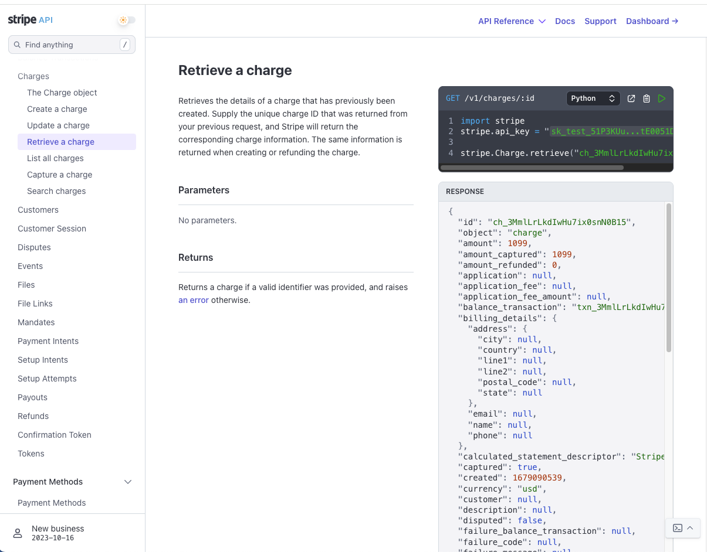

2. Short content bug

When there was not enough content on a page. It was not reaching the whole way down to the footer and there was a strange gap at the bottom of the page on lots of the pages on the website. See the screenshot below that depicts this problem.

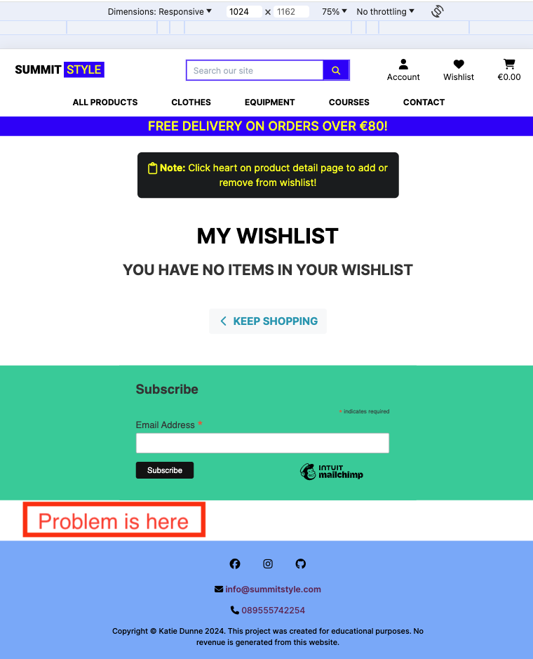

The fix is in the screenshot below. I set the contents of the container to flex. The items in the container were set to arrange vertically in a column. Flex grow was set to 1 and this means the contents will grow to take up all the available space on the vertical axis.


See the screenshot below, to see what it looks like since it was fixed.


3. Duplicate attribute id bug

When 'view page source' was clicked on the 'add a product' page and the code was copied into the html validator an error popped up saying 'duplicate attribute id'. The first screenshot below shows the page where the error occurred.


The screenshot below shows the error that appeared in the html validator.


Here are the further details of the error. It can be seen that a second id attribute is coming from 'django/forms/widgets/attrs.html'.


First of all, I tried to fix this by using a class instead of the id, but this didn't fix the problem. Then I was able to fix it by using a data attribute instead. See the fix in the screenshot of the commit below.


### Unfixed bugs

To my knowledge on submission of this project for assessment, there are no unfixed bugs.

### Supported screens and browsers

#### Screens

- iPhone SE, 375px wide. Also looks good down to 300px according to devtools
- iPad Mini, 768px wide
- Nest Hub Max, 1280px wide

#### Browsers

- Chrome
- Firefox
- Safari
- Edge
- Opera

## Deployment

### Pre deployment

### Stripe setup

This project used [Stripe](https://stripe.com) to handle all payments.

- Log in to [Stripe](https://stripe.com)
- Go to the developers section. The link is located in the top right of the page
- Go to API keys tab and copy the PUBLIC_KEY and SECRET_KEY and add them to your env.py file
- `STRIPE_PUBLIC_KEY` = starts with **pk**
- `STRIPE_SECRET_KEY` = starts with **sk**
- Go to the Webhooks tab and click on add endpoint
- Here you will need to give a link to the deployed application. The link should look like this: https://your_website.herokuapp.com/checkout/wh/
- Choose the events the webhook should receive and add endpoint
- You'll be given another key, the stripe webhook secret
- `STRIPE_WH_SECRET` = starts with **wh**
- When the application is deployed, run a test purchase to ensure the webhooks are working
- Go back to the webhooks page to check the events

### AWS setup

This project used [AWS](https://aws.amazon.com) to store static and media files.

Follow these steps to connect the project to AWS.

- Create an AWS account and login
- Go to the AWS Management Console under My Account

#### S3 Bucket

- Search for S3
- Create a new bucket, give it a name (usually matching your Heroku app name) and choose the region closest to you
- Under Object Ownership select ACLs enabled
- Make sure that Bucket Owner Preferred option is ticked
- Uncheck Block all public access and acknowledge that the bucket will be public
- Click Create Bucket
- From the Properties tab, turn on static website hosting and type `index.html` and `error.html` in their respective fields, then click Save
- From the Permissions tab, paste in the following CORS configuration:

```
[
 {
  "AllowedHeaders": [
   "Authorization"
  ],
  "AllowedMethods": [
   "GET"
  ],
  "AllowedOrigins": [
   "*"
  ],
  "ExposeHeaders": []
 }
]
```

From the Bucket Policy tab, select the Policy Generator link, and use the following steps:

- Policy Type: S3 Bucket Policy
- Effect: Allow
- Principal: `*`
- Actions: GetObject
- Amazon Resource Name (ARN): paste the arn from the bucket policy here
- Click Add Statement
- Click Generate Policy
- Copy the entire Policy, and paste it into the Bucket Policy Editor
- Add a /\* on to the end of the resource key, because we want to allow access to all resources in this bucket

```
{
  "Id": "Policy1234567890",
  "Version": "2012-10-17",
  "Statement": [
  {
    "Sid": "Stmt1234567890",
    "Action": [
    "s3:GetObject"
    ],
    "Effect": "Allow",
    "Resource": "arn:aws:s3:::your-bucket-name/*"
    "Principal": "*",
  }
  ]
}
```

- Click Save
- Go to the Access Control List (ACL) tab and set the List Objects Permission to Everyone (public access)
- Accept the warning box

#### IAM

The procedure here is; 1. you should create a group for the user to live in, 2. create an access policy giving the group access to the s3 bucket that was created and 3. assign a user to the group, so that it can use the policy to access all the files.

Go back to the AWS Services Menu and follow these steps:

1. Create a group

- Search for IAM (Identity and Access Management) and open it
- Click on create user group
- Add a name and click create group. The users and permission policies will be added later

2. Create an access policy

- Click the policies button on the left hand side and then click the create policy button
- Click on actions and import policy
- Search for "AmazonS3FullAccess", select this policy, and click Import
- Click "JSON" under "Policy Document" to see the imported policy
- Copy the bucket ARN from the bucket policy page and paste it into the "Resource" section of the JSON snippet.
- Copy the bucket ARN a second time into the "Resource" section of the JSON snippet. This time, add "/\*" to the end of the ARN to allow access to all resources in this bucket

```
    {
    "Version": "2012-10-17",
    "Statement": [
        {
            "Effect": "Allow",
            "Action": [
                "s3:*",
                "s3-object-lambda:*"
            ],
            "Resource": [
                "arn:aws:s3:::your-project",
                "arn:aws:s3:::your-project/*"
            ]
        }
    ]
}

```

- On the next page add policy name and description and click create policy
- To attach Policy to User Group, first click on User Groups in the left-hand menu
- Click on the user group name created during the above step and select the permissions tab
- Click Attach Policy
- Search for the policy you just created, select it and click attach policy

3. Create User

- On the users page, click on add user
- Enter a User name
- Select Programmatic access and AWS Management Console access and click next
- Click on add user to group, select the user group created earlier and click create user
- Take note of the Access key and Secret access key as these will be needed to connect to the S3 bucket
- At this point it's important to download and save this CSV file containing the access keys, because once you have gone through this process you can't download them again

#### Final steps for AWS setup

- Configure Django to connect to S3

### Deploying with heroku

After account setup, the steps were as follows:

- Click the "create new app" button on heroku
- Create a unique name for the app
- Select region (Europe was selected for this project)
- Click "create app"
- Select the deployment method (github was used for this project)
- Search for the github repository name (it was summit_style for this project)
- Click connect
- There is an option to use manual deployment or automatic deployment. Make sure main branch is selected
- In the settings tab select reveal config vars. Input the required hidden variables
- Select python as the buildpack
- Deploy
- After the first deployment you will see a message saying "your app was successfully deployed" and there will be a "view" button to take you to your deployed application

The live link for this project can be found here - [Summit Style](https://summit-style-b727a186ee80.herokuapp.com/)

### Fork this repository

- Go to the [GitHub repository](https://github.com/KSDunne/summit_style)
- Click on the Fork button in the upper right-hand corner
- Once clicked, you should have a copy of the original repository in your own GitHub account

### Clone

The repository can be cloned by following these steps:

- Go to the [GitHub repository](https://github.com/KSDunne/summit_style)
- Click the Code button near the top of the page
- Select 'HTTPS', 'SSH', or 'Github CLI', depending on how you would like to clone
- Click the copy button to copy the URL to your clipboard
- Open Git Bash
- Change the current working directory to where you want the cloned directory
- Type git clone and paste the URL ($ git clone https://github.com/YOUR-USERNAME/YOUR-REPOSITORY)
- Press enter to create your clone locally

Note: The difference between fork and clone is, you need permissions to push back to the original from a clone, but not a fork. This is because a fork will be completely your own new project.

## Credits

### Code

[CI walkthrough boutique ado](https://github.com/Code-Institute-Solutions/boutique_ado_v1/tree/250e2c2b8e43cccb56b4721cd8a8bd4de6686546) - The CI walkthrough repo was relied upon as a template for this project. I altered styling and there are 3 unique models added. Two are completely custom (star model and contact request) and 1 has been altered from boutique ado (wishlist added to products model).

[Category model](https://github.com/Code-Institute-Solutions/boutique_ado_v1/blob/5e595d250f0d7a408a7ccd40bfa25d24c000034dproducts/models.py#L3) - The category model was used from boutique ado.

[User profile model](https://github.com/Code-Institute-Solutions/boutique_ado_v1/blob/250e2c2b8e43cccb56b4721cd8a8bd4de6686546/profiles/models.py#L9) - The user profile model for maintaining default delivery information was taken from boutique ado.

[Products model](https://github.com/Code-Institute-Solutions/boutique_ado_v1/blob/5e595d250f0d7a408a7ccd40bfa25d24c000034d/products/models.py#L18) - This is the model that was customized by adding wishlist.

[Wishlist logic](https://github.com/Code-Institute-Solutions/Django3blog/blob/master/10_likes/blog/views.py#L69) - Logic for the wishlist was derived from the like feature shown on CI dashboard material.

[Wishlist product detail heart](https://github.com/Code-Institute-Solutions/Django3blog/blob/master/10_likes/templates/post_detail.html#L36) - Heart template code was derived from the like feature shown on CI dashboard material.

[My wishlist template](https://github.com/Harry-Leepz/Nourish-and-Lift/blob/main/wishlist/templates/wishlist/wishlist.html) - The idea for the 'my wishlist' page was seen on another CI students project. The template code was adapted from here.

[Star rating tutorial](https://medium.com/p/e1deff03bb1c) - This is the tutorial I used to add the star rating and then I added the review feature to this model as it made sense to put rate and review together.

[Daisy's recipe edit tutorial repository](https://github.com/Dee-McG/Recipe-Tutorial/blob/main/recipes/views.py#L61) - Daisy uses an EditRecipe class to update a recipe. I adapted this class for my purpose which was to edit a review.

[Daisy's recipe edit tutorial YouTube video](https://www.youtube.com/watch?v=JzDBCZTgVyw&list=PLXuTq6OsqZjbCSfiLNb2f1FOs8viArjWy&index=14) - Daisy explains how she creates the edit class in this video. I followed along with this video to write my EditReview view in the products app.

[Daisy's recipe delete tutorial repository](https://github.com/Dee-McG/Recipe-Tutorial/blob/main/recipes/views.py#L72) - Daisy uses a DeleteRecipe class to delete a recipe. I adapted this class for my purpose which was to delete a review.

[Daisy's recipe delete tutorial YouTube video](https://www.youtube.com/watch?v=nFa3lC105dM&list=PLXuTq6OsqZjbCSfiLNb2f1FOs8viArjWy&index=13) - Daisy explains how she creates the delete class in this video. I followed along with this video to write my DeleteReview view in the products app.

[Get context data](https://medium.com/@hassanraza/when-to-use-get-get-queryset-get-context-data-in-django-952df6be036a) - This method was used to pass the url back to the template as a variable, when the cancel button was clicked on the review edit or delete forms.

### Media

The main hero image is a man looking at mountains and it is on the index page and all auth pages. This is from [shutterstock](https://www.shutterstock.com/image-photo/happy-hiker-winning-reaching-life-goal-366801260)

The hero image on the contact page is 2 people on the phone outdoors. This is from [shutterstock](https://www.shutterstock.com/image-photo/two-people-talking-on-phones-park-234528652)

All product images are stock photos from [pexels](https://www.pexels.com/)

### Inspiration from real world ecommerce websites

[Regatta](https://www.regatta.com/)

[Patagonia](https://eu.patagonia.com/gb/en/home/)

[Alex Moran Mountaineering](https://www.alexmoranmountaineering.co.uk/)

## Acknowledgements

Thank you to family, friends and pets for the support. Also thank you to my mentor and CI cohort facilitator :sparkles:
