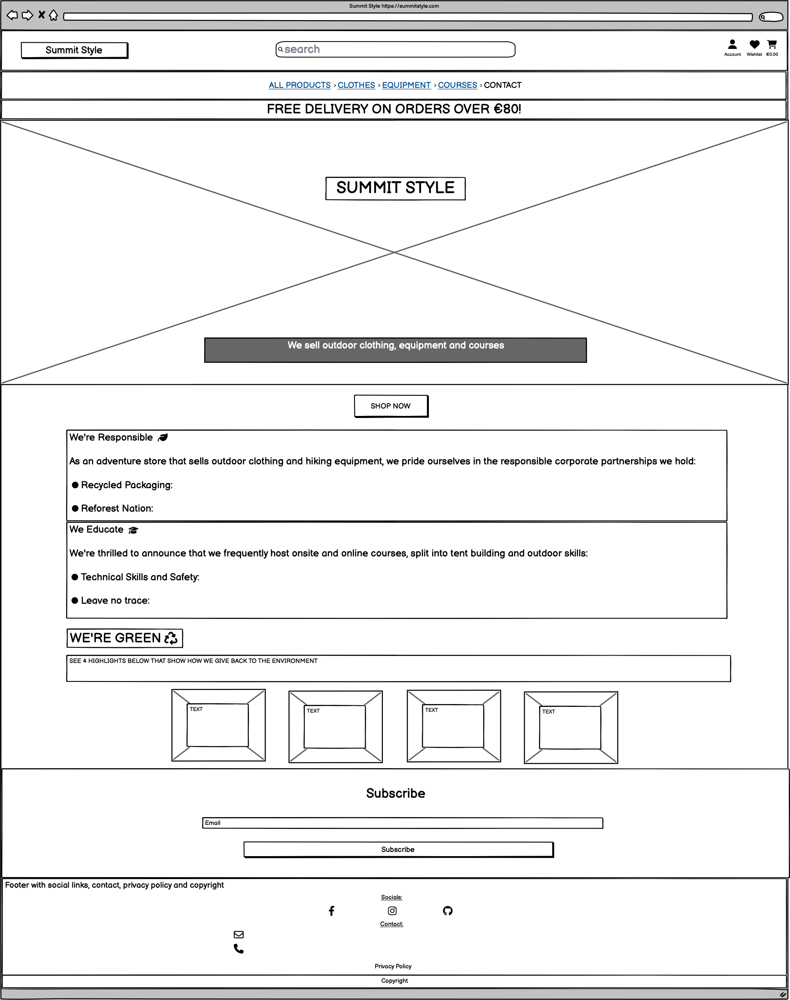
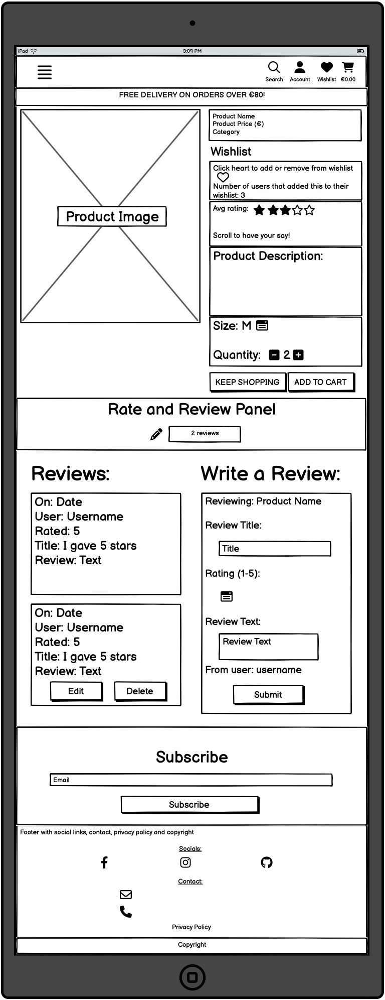
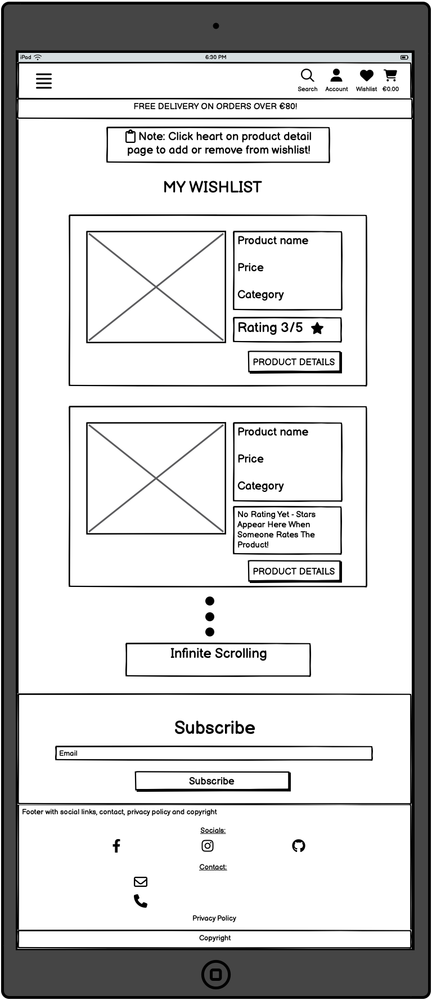

# Summit Style

(Developer: Katie Dunne)


## Live website

Link to live website: [Summit Style](https://summit-style-b727a186ee80.herokuapp.com/)

## Purpose of the project

Here is an eCommerce website, for a fictitious business called Summit Style. This is a full stack website built using the Django web framework. This business sells adventure clothing, equipment and short educational courses based on outdoor skills. There is a star rating feature on all products and courses. All offerings have a review feature. There is a wishlist feature and there is also a contact tab.

## Table of contents

## Ecommerce

An ecommerce app is designed to facilitate commercial or business transactions and it involves an online transfer of information.

- Summit style is a retail store and it is a B2C (business to customer) type of business
- The deliverables here are products (clothes, tents, sleeping bags) and digital products (if course is online) or services (if course is offered onsite)
- This business uses a single payment system, that is the transaction is finished after a single payment is made

## User experience (UX)

### Key project goals

- Build a website that quickly conveys the message that it is a adventure themed shop
- Create a website where users can see what is being sold easily and can readily access the offerings
- Add 3 features that enhance the experience of a user visiting an ecommerce website; 1. star ratings and reviews, 2. a wishlist feature and 3. a contact form.

### Target audience

- Users that are interested in outdoor and adventure hobbies
- Users that want to buy clothes that are specifically made with outdoor functionality (e.g. fleece, coats, base layers, wetsuits)
- Users that are interested in equipment for outdoor and adventure hobbies (e.g. tents, sleeping bags)
- Users that would like to learn about outdoors and adventure hobbies through short courses

### User requirements and expectations

- Easy navigation whether using mobile, tablet or monitor
- Ability to quickly understand the purpose of the website
- An accessible website for all users
- A secure payment system
- A secure data protection policy
- Detailed product information
- Visually appealing and responsive design
- An ability to see how other customers rate and review products
- An ability to add products to a wishlist for interaction at a later time
- An ability to contact the business easily
- Users expect businesses to have responsible ethics

## Epics and user stories

### Epics

1. Viewing and navigation of products and courses
2. Registration and user accounts
3. Sorting and searching
4. Purchasing and checkout
5. Store management
6. Rating and review feature
7. Wishlist feature
8. Contact app

### User stories

- As a website user, I want to be able to:

1. View a list of clothing products, so that I can select some to buy (epic 1)
2. View a list of outdoor equipment products, so that I can select some to buy (epic 1)
3. View a list of short courses, so that I can select some to buy (epic 1)
4. View a specific category of products or courses, so that I can quickly find what I'm interested in (epic 1)
5. View individual product details, so that I am informed of price, description and product rating (epic 1)
6. View individual course details, so that I am informed of price, description and rating (epic 1)
7. Identify sale items easily, so that I can take advantage of savings on products I want to buy (epic 1)
8. See the total of my purchases at any time to avoid overspending (epic 4)
9. Register for an account, so that I can have a profile that is specific to me (epic 2)
10. Easily log in and out to access my personal account information and to protect it once I’m finished interacting with it (epic 2)
11. Easily recover my password if I forget it, so that I can recover access to my account (epic 2)
12. Receive an email confirmation after registering to verify my account registration (epic 2)
13. Have a personalised user profile, so that I can view my order history, order confirmations and save delivery information (epic 2)
14. Quickly separate a list of clothing products from a list of equipment and a list of courses (epic 3)
15. Sort the list of offerings (clothes, equipment or courses), so that I can easily distinguish the best priced or categorically sort products (epic 3)
16. Sort a specific category of product or course, so that I can find the best priced in a specific category (epic 3)
17. Search for a product or course by name or description so that I can find a specific product or course (epic 3)
18. Easily see what I've searched for and the number of results so that I can quickly see if the product or course I want is available here (epic 3)
19. Easily select the size of a product when purchasing it, so that I don’t accidentally order the wrong size of clothing (epic 4)
20. View items in my cart to be purchased, so that I’m aware of the total cost of items and all the items that I will receive after checkout (epic 4)
21. Adjust the quantity of individual items in my cart, so that I can make changes to my order before checkout if I wish to do so (epic 4)
22. Easily enter my personal payment information, so that I can checkout quickly (epic 4)
23. Feel that my personal and payment information is safe, so that I can confidentially provide the information to make a purchase (epic 4)
24. View an order confirmation after checkout, so that I can verify that I haven’t made any mistakes (epic 4)
25. Receive an email confirmation after I make a purchase, so that I can keep the confirmation for my own records (epic 4)
26. See average star ratings on products quickly and easily, so that I don't have to go searching for ratings and I can buy a reliable product or course (epic 6)
27. Submit my star rating, so that I can give a vote on how good the product or course is (epic 6)
28. Read reviews that other customers have submitted, so that I feel I am purchasing a reliable product (epic 6)
29. Submit a review using a front end form with fields for title, star rating and review text (epic 6)
30. Edit the review I gave, in case I change my mind on how good a product or course is (epic 6)
31. Delete a review I submitted in case I rate the wrong product or I change my mind about giving my opinion (epic 6)
32. Read testimonials from other customers so that I feel like I am making a reliable purchase
33. Submit a testimonial of my own so that I can give my opinion on my purchase from this company
34. Find the contact page easily, so that I don't get frustrated trying to contact the company (epic 8)
35. Contact summit style using a contact form and recieve feedback that my query has been stored and the company will respond in a few days (epic 8)
36. Toggle a heart button to add and remove products and courses from my wishlist, so that when I have the money or when they go on special offer I can access them easily (epic 7)
37. Go to a page that has a list of my wishlist items, so that I don't have to spend time looking all over the site for items that I liked in the past (epic 7)
38. Easily locate the privacy policy, so that I can see how my personal data is protected (epic 2)

- As a store owner, I want to be able to:

39. Add a product or course, so that I can add new offerings as they become available for me to sell (epic 5)
40. Edit or update a product or course information, so that I can change product and course prices, descriptions and images if needed (epic 5)
41. Delete a product or course, so that I can remove items that are no longer for sale (epic 5)
42. Not delete products by an accident. I get asked are you sure (epic 5)

## Sprints

1. Development environment setup
2. Design (wireframes and colors)
3. Data mapping of entity relationship diagrams
4. Viewing and navigation of products and courses
5. Registration and user accounts
6. Sorting and searching
7. Purchasing and checkout
8. Store management
9. Add rating and review feature
10. Wishlist feature
11. Contact app
12. Testing
13. Project sunset

## Features

### Logo and navigation bar

#### Mobile navigation using burger menu

On mobile and tablet size screens site navigation uses a burger menu and 4 icons. The burger menu has the following navigation options; home, all products, clothes, equipment, courses and contact. The 4 icons are; search, account, wishlist and shopping cart with the current spend displayed underneath it.


#### Monitor navigation bar

On monitor size screens, this is split into 2 divs. The top nav which contains the logo, a search bar, an account dropdown menu, a wishlist icon and a shopping cart logo with link to the shopping cart. This shopping cart also shows a running total of the users spend. The second part is the main site navigation bar. This main navbar contains downdown menus and links with titles; all products, clothes, equipment, courses and contact.


### Hero image with cover text

The index page hero image was chosen because it fits the theme of the website. There is a man with hiking gear looking at some mountains in the distance. The colors of this image also align with the theme and design of the overall website. The main mountain hero image can also be seen on allauth pages (e.g. register, login and logout)


### Shop now button

This is a call to action on the index page. This button brings the user to the all products page.


### Were responsible

This is a section on the index page to convey that summit style is an ethical company with responsible values. It shows that summit style uses recycled packaging and that they have a corporate partnership with a reforestation website.


### We educate

This section on the index page showcases the fundamental pillars supporting the courses available on this website.


### We're green section

These are responsive boxes highlighting again how summit style is a responsible, ethical and green company to buy from.


### Newsletter sign up

Mailchimp was used for the newsletter signup. The code for this is in base.html, so it shows up on all pages right above the footer.


### Footer

The footer has the business email, phone number, social media links, a link to the privacy policy and a copyright.


### Sign in form

This is a crispy form that asks for username and password. It was styled with a yellow background.


### Register form (Sign up)

This is a crispy form. It is styled with a light yellow background and I removed the bullet point dots that are normally present on the password instructions (e.g. your password must contain at least 8 characters).


### Sign out page

The signout page is defensive. It asks the user 'Are you sure you want to sign out?'


### Shopping cart empty

When a user clicks on the shopping cart, but they haven't added any items yet. The page will display "Your cart is empty" and a button to keep shopping.


### Shopping cart with items

This page shows the product image, the name of the product, the size if applicable, the sku, the price, quantity and subtotal for every product in the cart. The cart total, the delivery cost and the grand total are also displayed on this page.


### Search bar

#### Search bar on mobile

When the user clicks on the magnifying glass a search bar form will dropdown. The search bar works well for item names and descriptions.


#### Search bar on a monitor

On monitor size screens, that is >992px, the search bar is displayed on the topnav.


### Product cards

Product cards contain a product image, name of the product, price, category and average rating. If you are logged in as a superuser you can also see edit and delete buttons. The delete button is defensive.


### Sort dropdown

The options for filtering are by price, name and category.


### Product detail

The product detail page contains a product image, name, price, category, toggle wishlist heart, star ratings, description, quantity buttons and size dropdown options if applicable. There are "keep shopping" and "add to cart" buttons here too. The product detail page also contains a rate and review panel.
 


### Average star rating

When multiple users add a rating, out of five, to the review form the average number is calculated. This average number is shown on the products page and the product detail page.


### Rate and review panel

This panel shows the number of reviews that have been submitted for that particular item, it shows the reviews from latest to oldest and there is a form for submitting your own review. The name of the item being reviewed is shown at the top of the form, so that the user doesn't write a review with the wrong product in mind and their username is shown at the bottom of the form for personalisation.


### Wishlist

### Account management, add, edit, delete products

### Custom 404 page

## Future features

- Notifications when items are sold out
- Instant access to digital products. When a course is bought the customer instantly receives a PDF or access to a course video
- Subscription to course material (pdfs and videos)

### MoSCoW

## Three custom models

1. Average Star Rating and Reviews

This has full FE CRUD functionality for your rating and reviews

2. Wishlist feature

There is a heart button that can be toggled on and off to add and remove items from your personal wishlist

3. Record user contact requests in the database

This is on a contact app with tab of its own

## Keyword research and SEO

Good seo means that more potential customers can find your website. Keyword research tells us what topics people care about and how popular these topics are among your audience. Short-tail keywords are 1-2 words long and highly competitive. Long-tail keywords are usually in the form of a phrase or sentence and competition is lower.

Short tail keywords used on this app:

- Hiking clothes
- Hiking equipment
- Adventure courses
- Irish hiking
- Outdoors

Long tail keywords used on this app:

- Clothes for hiking in Ireland
- Hiking clothes Ireland
- Equipment for camping in Ireland
- Hiking equipment for beginners
- Irelands toughest hike
- Adventure courses in Ireland
- Outdoors shop dublin

Here are some screenshot examples of how I did my keyword research. It involved using the search bar in google and the suggested searches that popped up in the dropdown menu. I also looked at the longer tailed questions that were frequently asked on google.

### Hiking clothes keyword

See the screenshot of the dropdown on google for this short-tailed keyword


### Hiking equipment keyword

See the screenshot of the dropdown on google for this short-tailed keyword


### Adventure courses keyword

See the screenshot of the dropdown on google for this short-tailed keyword


Also, see a site I found during my research, that is selling online courses for mountaineering in Scotland


## Marketing

This site has a Mailchimp newsletter signup, which is used to collect email addresses for marketing purposes. A facebook business page was also setup.

### Newsletter


### Facebook

Firstly, a logo was designed using [hubspot brand kit generator](https://www.hubspot.com/brand-kit-generator). This was used as the profile picture for the facebook page. The logo includes an icon that looks like a person with a bag on their back, climbing a mountain and the business name beside the icon. The main hero image from the website was used as the cover photo.


A 'sign up' call to action button was added to the facebook page that links back to the main heroku website encouraging facebook users to navigate to our site and sign up to the newsletter. A post was also created with a link to the live heroku website.


## Design

### Color

#### Color palette 1


#### Color palette 2


## Wireframes

### Index page wireframes

#### Mobile


#### Tablet


#### Monitor



### Products page

#### Mobile


#### Tablet


#### Monitor


### Product detail page

Two of the three custom models can be seen here.

- Firstly the product model which uses a 'wishlist' field can be seen here with a toggle heart and an 'is_course' boolean field that changes the sizes section to a section that contains whether the course is in-person or online and the length of the course.

- Secondly, the star model comes through here with full crud functionality for ratings and reviews.

#### Mobile


#### Tablet



#### Monitor


### Contact page

- The third custom model can be seen on the FE here.

#### Mobile


#### Tablet


#### Monitor


### Wishlist page

- The 'many-to-many' wishlist field in the product model is utilised on this page.

#### Mobile


#### Tablet



#### Monitor


### Register page

#### Mobile


#### Tablet


#### Monitor


### Login page

#### Mobile


#### Tablet


#### Monitor


## Database schema

### Entity relationship diagram

In the diagram below, OneToOne, ManyToMany and Foreign Key relationships can be seen.


### Entity relationship tables

Please find a screenshot of tables below. These tables were created as rough work in preparation for the final entity relationship diagram (ERD).


## Technology Used

### Languages

- [HTML5](https://developer.mozilla.org/en-US/docs/Learn/HTML "link to html mozilla documentation")
  was used to create content and structure
- [CSS](https://developer.mozilla.org/en-US/docs/Learn/CSS "link to css mozilla documentation")
  was used to add custom styles
- Javascript
- Python

### Frameworks and libraries

- [Django 4.2.10](https://www.djangoproject.com/ "link to django docs homepage") was the python framework used to develop the site
- Bootstrap

### Database

- [PostgreSQL from Code Institute](https://dbs.ci-dbs.net/ "link to postgresql from code institute") was used as the PostgreSQL database for this project

### Technologies and tools

- [Django allauth](https://docs.allauth.org/en/latest/ "link to official allauth documentation") addresses authentication, registration and account management

## Testing

Detailed testing documentation can be found [here.](./TESTING.md)

### Fixed bugs

Leaving this here as a reminder for me to come back to it later:

1. Webhook handler handling profiles
2. wh handler key and testing
3. allauth?

### Unfixed bugs

### Supported screens and browsers

#### Screens

- iPhone SE, 375px wide. Also looks good down to 300px according to devtools
- iPad Mini, 768px wide
- Nest Hub Max, 1280px wide

#### Browsers

- Chrome
- Firefox
- Safari
- Edge
- Opera

## Deployment

### Pre deployment

### Stripe setup

This project used [Stripe](https://stripe.com) to handle all payments.

- Log in to [Stripe](https://stripe.com)
- Go to the developers section. The link is located in the top right of the page
- Go to API keys tab and copy the PUBLIC_KEY and SECRET_KEY and add them to your env.py file
- `STRIPE_PUBLIC_KEY` = starts with **pk**
- `STRIPE_SECRET_KEY` = starts with **sk**
- Go to the Webhooks tab and click on add endpoint
- Here you will need to give a link to the deployed application. The link should look like this: https://your_website.herokuapp.com/checkout/wh/
- Choose the events the webhook should receive and add endpoint
- You'll be given another key, the stripe webhook secret
- `STRIPE_WH_SECRET` = starts with **wh**
- When the application is deployed, run a test purchase to ensure the webhooks are working
- Go back to the webhooks page to check the events

### AWS setup

This project used [AWS](https://aws.amazon.com) to store static and media files.

Follow these steps to connect the project to AWS.

- Create an AWS account and login
- Go to the AWS Management Console under My Account

#### S3 Bucket

- Search for S3
- Create a new bucket, give it a name (usually matching your Heroku app name) and choose the region closest to you
- Under Object Ownership select ACLs enabled
- Make sure that Bucket Owner Preferred option is ticked
- Uncheck Block all public access and acknowledge that the bucket will be public
- Click Create Bucket
- From the Properties tab, turn on static website hosting and type `index.html` and `error.html` in their respective fields, then click Save
- From the Permissions tab, paste in the following CORS configuration:

```
[
 {
  "AllowedHeaders": [
   "Authorization"
  ],
  "AllowedMethods": [
   "GET"
  ],
  "AllowedOrigins": [
   "*"
  ],
  "ExposeHeaders": []
 }
]
```

From the Bucket Policy tab, select the Policy Generator link, and use the following steps:

- Policy Type: S3 Bucket Policy
- Effect: Allow
- Principal: `*`
- Actions: GetObject
- Amazon Resource Name (ARN): paste the arn from the bucket policy here
- Click Add Statement
- Click Generate Policy
- Copy the entire Policy, and paste it into the Bucket Policy Editor
- Add a /\* on to the end of the resource key, because we want to allow access to all resources in this bucket

```
{
  "Id": "Policy1234567890",
  "Version": "2012-10-17",
  "Statement": [
  {
    "Sid": "Stmt1234567890",
    "Action": [
    "s3:GetObject"
    ],
    "Effect": "Allow",
    "Resource": "arn:aws:s3:::your-bucket-name/*"
    "Principal": "*",
  }
  ]
}
```

- Click Save
- Go to the Access Control List (ACL) tab and set the List Objects Permission to Everyone (public access)
- Accept the warning box

#### IAM

The procedure here is; 1. you should create a group for the user to live in, 2. create an access policy giving the group access to the s3 bucket that was created and 3. assign a user to the group, so that it can use the policy to access all the files.

Go back to the AWS Services Menu and follow these steps:

1. Create a group

- Search for IAM (Identity and Access Management) and open it
- Click on create user group
- Add a name and click create group. The users and permission policies will be added later

2. Create an access policy

- Click the policies button on the left hand side and then click the create policy button
- Click on actions and import policy
- Search for "AmazonS3FullAccess", select this policy, and click Import
- Click "JSON" under "Policy Document" to see the imported policy
- Copy the bucket ARN from the bucket policy page and paste it into the "Resource" section of the JSON snippet.
- Copy the bucket ARN a second time into the "Resource" section of the JSON snippet. This time, add "/\*" to the end of the ARN to allow access to all resources in this bucket

```
    {
    "Version": "2012-10-17",
    "Statement": [
        {
            "Effect": "Allow",
            "Action": [
                "s3:*",
                "s3-object-lambda:*"
            ],
            "Resource": [
                "arn:aws:s3:::your-project",
                "arn:aws:s3:::your-project/*"
            ]
        }
    ]
}

```

- On the next page add polcity name and description and click create policy
- To attach Policy to User Group, first click on User Groups in the left-hand menu
- Click on the user group name created during the above step and select the permissions tab
- Click Attach Policy
- Search for the policy you just created, select it and click attach policy

3. Create User

- On the users page, click on add user
- Enter a User name
- Select Programmatic access and AWS Management Console access and click next
- Click on add user to group, select the user group created earlier and click create user
- Take note of the Access key and Secret access key as these will be needed to connect to the S3 bucket
- At this point it's important to download and save this CSV file containing the access keys, because once you have gone through this process you can't download them again

#### Final steps for AWS setup

- Configure Django to connect to S3

### Deploying with heroku

After account setup, the steps were as follows:

- Click the "create new app" button on heroku
- Create a unique name for the app
- Select region (Europe was selected for this project)
- Click "create app"
- Select the deployment method (github was used for this project)
- Search for the github repository name (it was summit_style for this project)
- Click connect
- There is an option to use manual deployment or automatic deployment. Make sure main branch is selected
- In the settings tab select reveal config vars. Input the required hidden variables
- Select python as the buildpack
- Deploy
- After the first deployment you will see a message saying "your app was successfully deployed" and there will be a "view" button to take you to your deployed application

The live link for this project can be found here - [Summit Style](https://summit-style-b727a186ee80.herokuapp.com/)

### Fork this repository:

- Go to the [GitHub repository](https://github.com/KSDunne/summit_style)
- Click on the Fork button in the upper right-hand corner
- Once clicked, you should have a copy of the original repository in your own GitHub account

### Clone

The repository can be cloned by following these steps:

- Go to the [GitHub repository](https://github.com/KSDunne/summit_style)
- Click the Code button near the top of the page
- Select 'HTTPS', 'SSH', or 'Github CLI', depending on how you would like to clone
- Click the copy button to copy the URL to your clipboard
- Open Git Bash
- Change the current working directory to where you want the cloned directory
- Type git clone and paste the URL ($ git clone https://github.com/YOUR-USERNAME/YOUR-REPOSITORY)
- Press enter to create your clone locally

Note: The difference between fork and clone is, you need permissions to push back to the original from a clone, but not a fork. This is because a fork will be completely your own new project.

## Credits

### Code

[Star rating tutorial](https://medium.com/p/e1deff03bb1c)
[Wishlist logic](https://github.com/Code-Institute-Solutions/Django3blog/blob/master/10_likes/blog/views.py#L69)
[Wishlist product detail heart](https://github.com/Code-Institute-Solutions/Django3blog/blob/master/10_likes/templates/post_detail.html#L36)
[My wishlist template](https://github.com/Harry-Leepz/Nourish-and-Lift/blob/main/wishlist/templates/wishlist/wishlist.html)

### Media

### Inspiration from real world ecommerce websites

## Acknowledgements

Thank you to family, friends and pets for the support. Also thank you to my mentor and CI cohort facilitator :sparkles:
